<div align="center">

# 🎬 MathVizAI

### Transform Mathematical Concepts into Stunning Visualizations

[](https://github.com/Trimpu/MathVizAI/stargazers)
[](LICENSE)
[](https://reactjs.org/)
[](https://flask.palletsprojects.com/)
[](https://www.manim.community/)

**A powerful web application that combines OCR (Optical Character Recognition) with Manim (Mathematical Animation Engine) to automatically generate educational math videos from handwritten or typed mathematical expressions.**

[ Demo](#-demo) • [ Features](#-features) • [ Installation](#-https://github.com/Trimpu/MathVizAI?tab=readme-ov-file#installation) • [ Usage](#-usage) • [ API](#-api-reference)

</div>

---

##  Demo

<!-- Add your demo GIF or video here -->
<div align="center">
  
>  **Demo coming soon!** We're preparing video demonstrations of MathVizAI in action.

<!-- Uncomment and replace with actual demo when available:


### Watch the Full Demo
[](https://youtube.com/your-demo-link)
-->

</div>

### Screenshots

<div align="center">
<table>
<tr>
<td align="center"><strong>📄 PDF Viewer with OCR</strong></td>
<td align="center"><strong>🎬 Video Generation</strong></td>
</tr>
<tr>
<td>
<!-- Add screenshot:  -->
<em>Screenshot coming soon</em>
</td>
<td>
<!-- Add screenshot:  -->
<em>Screenshot coming soon</em>
</td>
</tr>
<tr>
<td align="center"><strong>🔍 OCR Selection Mode</strong></td>
<td align="center"><strong>📊 Generated Animation</strong></td>
</tr>
<tr>
<td>
<!-- Add screenshot:  -->
<em>Screenshot coming soon</em>
</td>
<td>
<!-- Add screenshot:  -->
<em>Screenshot coming soon</em>
</td>
</tr>
</table>
</div>

---

##  Features

<div align="center">

| Feature | Description |
|---------|-------------|
|  **Advanced OCR** | MixTeX ONNX model for accurate LaTeX extraction from images |
|  **AI Video Generation** | GPT-4 powered Manim animations for mathematical concepts |
|  **PDF Support** | High-quality PDF rendering with intelligent text selection |
|  **Modern UI** | Windscribe-inspired dark theme with glassmorphism effects |
|  **Real-time Progress** | Live tracking of video generation with detailed status |
|  **Smart Fallbacks** | Robust error handling with automatic recovery |

</div>

###  Frontend (React + TailwindCSS)
- **PDF Viewing** - High-quality rendering with react-pdf
- **OCR Selection** - Drag-to-select regions for mathematical content extraction
- **Floating UI** - Dynamic buttons appear on text selection
- **Video Player** - Built-in player for generated animations
- **Loading States** - Comprehensive progress tracking with real-time updates
- **Dark Theme** - Beautiful purple-gradient Windscribe-inspired design

###  Backend (Flask + Manim + AI)
- **AI Integration** - OpenAI GPT-4 and GitHub AI Models
- **Video Generation** - Manim-powered mathematical animations
- **OCR Processing** - MixTeX model for LaTeX extraction
- **RESTful API** - Clean endpoints with CORS support
- **Error Handling** - Robust error handling with detailed logging

---

## 📁 Project Structure

```
MathVizAI/
├── 📂 src/                           # React Frontend
│   ├── 📂 components/
│   │   ├── PdfViewer.jsx            # Main PDF viewer with OCR
│   │   ├── FloatingButton.jsx       # Selection UI component
│   │   ├── VideoPlayer.jsx          # Video playback modal
│   │   ├── LoadingModal.jsx         # Progress tracking modal
│   │   ├── Toolbar.jsx              # Navigation toolbar
│   │   └── ExplanationViewer.jsx    # Text explanation viewer
│   └── 📂 services/
│       └── api.js                   # Backend API integration
│
├── 📂 backend/                       # Flask Backend
│   ├── app.py                       # Main Flask application
│   ├── mixtex_core.py               # OCR processing module
│   ├── requirements.txt             # Python dependencies
│   ├── 📂 onnx/                     # OCR model files
│   └── 📂 videos/                   # Generated videos
│
├── 📂 public/                        # Static assets
├── package.json                      # Node.js dependencies
├── tailwind.config.js               # TailwindCSS configuration
└── README.md                        # You are here! 📍
```

---

##  Installation

### Prerequisites

- **Node.js** v16 or higher
- **Python** 3.8+
- **FFmpeg** (for video processing)
- **MiKTeX** or **TeX Live** (for mathematical notation)

### Quick Start

```bash
# Clone the repository
git clone https://github.com/Trimpu/MathVizAI.git
cd MathVizAI

# Install frontend dependencies
npm install

# Install backend dependencies
cd backend
pip install -r requirements.txt
```

### Environment Setup

Create a `.env` file in the `backend` directory:

```env
OPENAI_API_KEY=your_openai_api_key
GITHUB_TOKEN=your_github_token
```

### Running the Application

**Terminal 1 - Backend:**
```bash
cd backend
python app.py
```
> Flask server starts on `http://localhost:5000`

**Terminal 2 - Frontend:**
```bash
npm start
```
> React app starts on `http://localhost:3000`

---

##  Usage

```mermaid
graph LR
    A[ Load PDF] --> B[🔍 Select Math]
    B --> C[ Generate Video]
    C --> D[ Wait for Processing]
    D --> E[ Watch Animation]
```

<div align="center">



</div>

1. ** Load PDF** - Upload a mathematical PDF document
2. ** Select Content** - Use OCR mode to select mathematical expressions
3. ** Configure** - Choose difficulty level and video quality
4. ** Generate** - Click "Visualize" to create the animation
5. ** Watch & Learn** - View the generated mathematical animation

### Video Quality Options

| Quality | Resolution | Use Case |
|---------|------------|----------|
| 🟢 Low | 480p | Quick previews, faster generation |
| 🟡 Medium | 720p | Balanced quality and speed |
| 🔴 High | 1080p | Best visual quality for presentations |

### Difficulty Levels

- ** Beginner** - Basic explanations with simple animations
- ** Intermediate** - Moderate complexity with detailed steps
- ** Advanced** - Complex concepts with full derivations

---

##  API Reference

### Endpoints

| Method | Endpoint | Description |
|--------|----------|-------------|
| `POST` | `/api/generate-video` | Generate mathematical video |
| `POST` | `/api/extract-latex` | Extract LaTeX from image |
| `GET` | `/api/video-status/<id>` | Check generation progress |
| `GET` | `/api/video/<id>` | Retrieve generated video |
| `GET` | `/api/health` | Health check with service status |

### Health Check Response

```json
{
  "status": "healthy",
  "services": {
    "manim": true,
    "ocr": true,
    "ai": true,
    "sympy": true
  }
}
```

---

## 🛠️ Development

### Running Tests

```bash
# Frontend tests
npm test

# Backend tests
python -m pytest
```

### Building for Production

```bash
npm run build
```

### Tech Stack

<div align="center">

| Frontend | Backend | Tools |
|----------|---------|-------|
| React 18.2 | Flask 3.1 | Manim 0.19 |
| TailwindCSS 3.4 | OpenAI SDK | MixTeX OCR |
| react-pdf 7.7 | SymPy | FFmpeg |

</div>

---

##  Contributing

Contributions are welcome! Here's how you can help:

1.  Fork the repository
2.  Create a feature branch (`git checkout -b feature/amazing-feature`)
3.  Make your changes
4.  Add tests if applicable
5.  Commit your changes (`git commit -m 'Add amazing feature'`)
6.  Push to the branch (`git push origin feature/amazing-feature`)
7.  Open a Pull Request

---

##  License

This project is licensed under the **MIT License** - see the [LICENSE](LICENSE) file for details.

---

##  Acknowledgments

- [Manim Community](https://www.manim.community/) for the amazing animation engine
- [OpenAI](https://openai.com/) for GPT-4 API (via github marketplace)
- [MixTeX](https://github.com/RQLuo/MixTeX-Latex-OCR) for the OCR model 😇🙏
- [Windscribe](https://windscribe.com/) for UI design inspiration

---

<div align="center">

**Built with ❤️ by [Trimpu](https://github.com/Trimpu)**

⭐ Star this repo if you find it useful!

</div>
